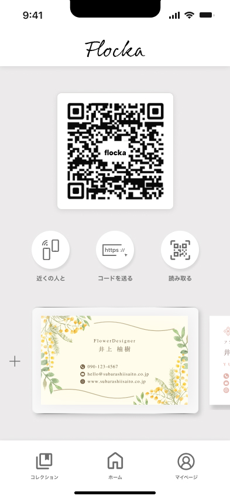
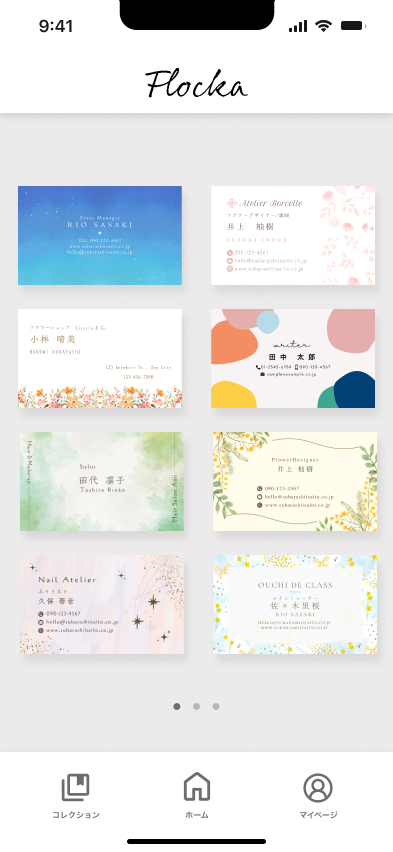
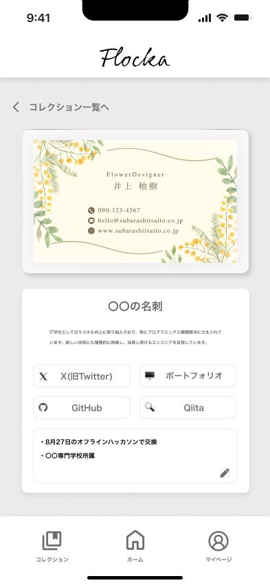

# Flocka　(フロッカ)

Flocka のクライアントアプリ（Expo + React Native）。


## 概要

Flocka は、趣味やコミュニティごとに使い分けられる電子名刺（プロフィールカード）を交換できるモバイルアプリです。本リポジトリはフロントエンド（React Native / Expo）で、バックエンドは `FlockaAPI` を参照します。





## 主要技術

- Expo Router (app ディレクトリ)
- React Native + TypeScript
- Expo 向け各種モジュール（Camera、SecureStore、QRCode など）

## 必要環境

- Node.js（推奨: 18.x 以上）
- npm
- （任意）Expo CLI: `npm install -g expo-cli`（`npx expo` で代用可）

## セットアップ（開発）

1. 依存関係のインストール

   ```bash
   npm install
   ```

2. 開発サーバを起動

   ```bash
   npm run start
   ```

3. 実機／エミュレータで確認

   - Expo Go（※一部ネイティブ機能は制限あり）
   - iOS シミュレータ / Android エミュレータ

## 主要スクリプト

- `npm run start` — Expo 開発サーバ起動
- `npm run android` — Android で起動
- `npm run ios` — iOS シミュレータで起動
- `npm run web` — Web で起動（React Native Web）
- `npm run lint` — ESLint を実行
- `npm run reset-project` — プロジェクト初期化スクリプト

## 主要な画面と機能

- `/` (Home) — QR 表示、カード切替、アクション（読み取りなど）
- `/sign-in` — ログイン
- `/sign-up` — 新規登録
- `/sign-up-auth` — メール認証待ち（再送ボタンなど）
- `/forgot-password` — パスワードリセット申請
- `/reset-password` — パスワード再設定（トークン入力）
